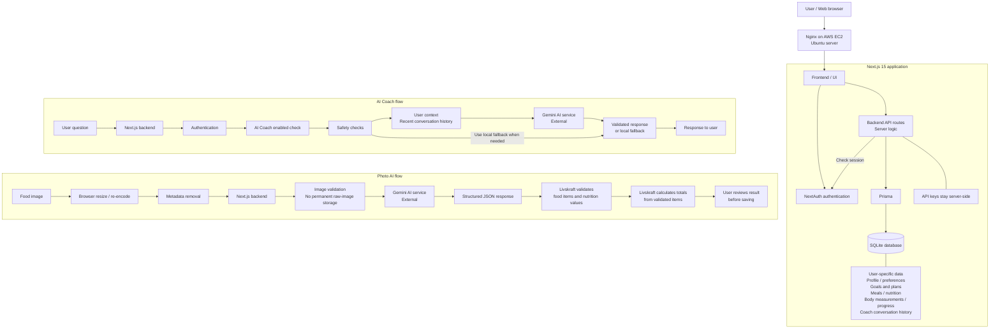
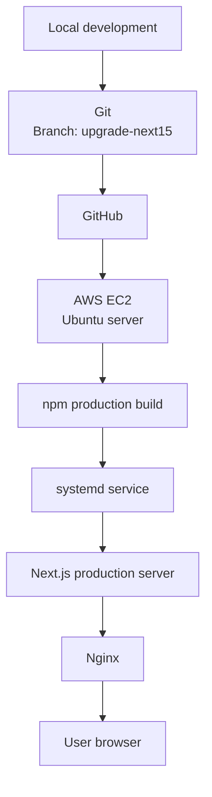

# Livskraft architecture

## System architecture

The two AI flows expand what happens behind the UI. Coach rejects requests if the user is not signed in or has not enabled AI Coach. Safety checks can select a local fallback instead of calling Gemini. Photo results are estimates that the user reviews before saving. API keys remain on the server, and Livskraft does not permanently store raw food images.

## Deployment flow

This shows the release path from local development to the server. The systemd service runs the built Next.js application. Nginx forwards browser requests to Next.js and returns its responses.

## Testing and quality

The project has been tested for:

- AI Coach: authentication, enabled checks, safety, conversation context and fallback replies.
- Photo AI: image validation, response validation, nutrition totals and review before saving.
- Saved user data / persistence: data remains available after saving and reloading.
- User isolation: users can access only their own stored data.
- Body measurements: saving and displaying measurements and progress.
- Language support: Swedish and English UI text and saved language preferences.
- TypeScript: checks for type errors.
- Production builds: checks that the application builds for production.

Automated AI tests use simulated provider responses; they do not prove that the external service is always available. These checks come from the project's existing tests and verification reports; no application tests were rerun for this documentation change.

## Short presentation explanation

Livskraft runs on an Ubuntu server on AWS EC2. Nginx forwards browser requests to the Next.js application, which is managed by systemd. Next.js provides the UI and backend, while NextAuth checks who is signed in. Prisma connects the backend to SQLite, where each user's profile, goals, plans, meals, measurements and Coach history are stored. AI Coach checks authentication, consent and safety before using Gemini, and can return a local fallback. Photo AI removes image metadata, validates the AI estimate and calculates nutrition totals before the user reviews and saves the result. API keys stay on the server, and Livskraft does not permanently store raw food images.
